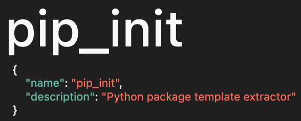

 

## Overview

Python パッケージテンプレート展開ユーティリティ

## Description

`pip_init` は、Pythonに `swift init` や `npm init` のような パッケージ初期化CLIを提供するユーティリティです。

## Usage

Under construction...

## License

This repository is published under [MIT License](LICENSE).
